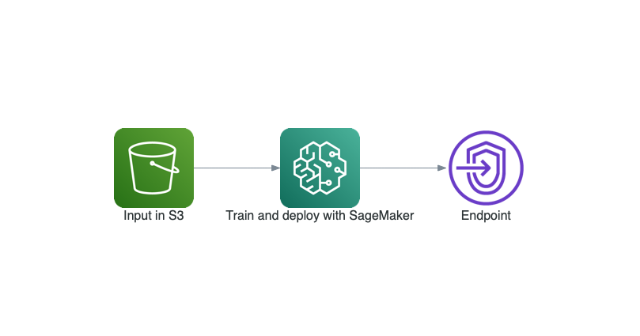
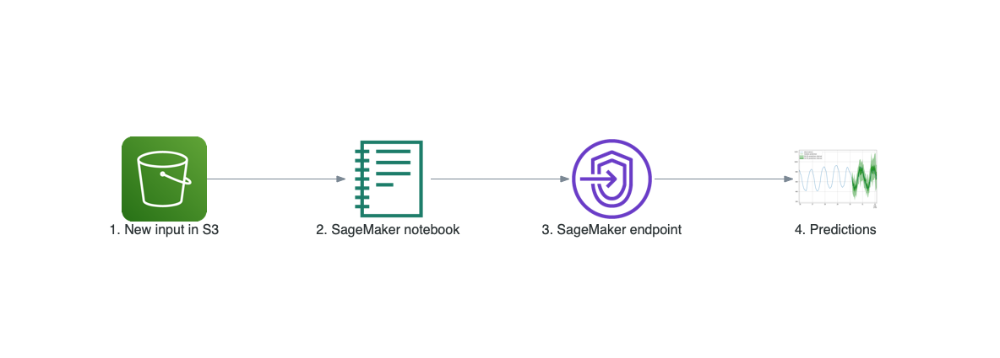
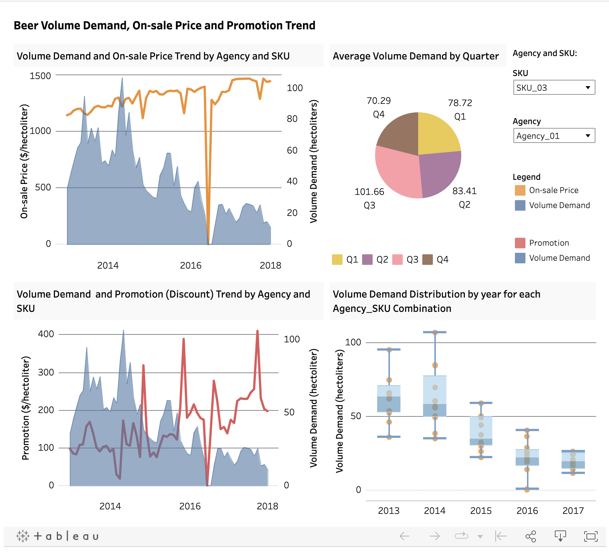

# Predicting product demand using the DeepAR algorithm deployed as an endpoint through API Gateway and AWS Lambda within the SageMaker environment.

## Project Highlights 

* Simultaneously forecasted the monthly volume demand (hectoliters) for 350 Agency-SKU (stock-keeping unit) combination beer products by leveraging DeepAR in SageMaker on AWS. This involved utilizing not only the historical data of the products but also incorporating influential factors such as price and promotions.
* Employed the auto-tuning job feature in SageMaker to train and fine-tune the DeepAR models, achieving a test error (RMSE) of 760.
* Deployed the tuned model as an endpoint, enabling predictions through API Gateway and AWS Lambda. The predictions were made accessible via the endpoint: https://wol03vnof2.execute-api.us-east-2.amazonaws.com/beta (now deleted to avoid ongoing charges).
* Conducted forecasting with a cold start, generating predictions for previously unseen Agency-SKU combinations.

## Project Object

The company, with an extensive array of beer products distributed through agencies to retailers, manages a vast number of unique agency-SKU/product combinations. Ensuring accurate monthly demand estimates at the SKU level for each agency is crucial for effective production and distribution planning, as well as aiding agencies in their own planning processes.

Our objective is to achieve the following using the DeepAR algorithm:

* Capitalizing on DeepAR's RNN framework, we aim to predict product demand by training the model not only on individual product historical data but also on the historical data of other variables (e.g., on-sale price and promotion price) that influence product demand.

* Forecasting the monthly demand volume (hectoliters) for each of the 350 Agency-SKU combinations throughout the year 2018, drawing insights from data spanning 2013-2017.

* Addressing cold start challenges by developing forecasts for the volume demand of new Agency-SKU combinations, where historical data is unavailable.

## Code and References

* **Environment setup:** AWS -- SageMaker -- Launch an instance (creating IAM role and connecting to GitHub repo) -- Create AWS SDK for Python (Boto3) -- Create more Jupyter notebooks when needed (managed by Jupyter Lab)
* **Language:** Python 3
* **Sagemaker Endpiont Deployment reference:** https://aws.amazon.com/blogs/machine-learning/call-an-amazon-sagemaker-model-endpoint-using-amazon-api-gateway-and-aws-lambda/ 
* **Dataset Source:** https://www.kaggle.com/utathya/future-volume-prediction
* **DeepAR Paper:** https://arxiv.org/pdf/1704.04110v3.pdf
* **DeepAR Article:** https://aws.amazon.com/blogs/machine-learning/now-available-in-amazon-sagemaker-deepar-algorithm-for-more-accurate-time-series-forecasting/
* **DeepAR Article:** https://towardsdatascience.com/deepar-mastering-time-series-forecasting-with-deep-learning-bc717771ce85


## Why use Amazon Sagemaker DeepAR Algorithm

DeepAR is a methodology designed to generate precise probabilistic forecasts by training autoregressive recurrent networks. This innovative approach learns a global model from the historical data of all time series within the dataset, building upon prior research in deep learning for time series data. It customizes a recurrent neural network architecture based on Long Short-Term Memory (LSTM) for the specific challenges of probabilistic forecasting.

In contrast to classical methods and other global approaches, DeepAR offers several key advantages:

* Minimal Manual Feature Engineering: DeepAR learns seasonal patterns and dependencies on covariates across time series, reducing the need for extensive manual feature engineering to capture intricate, group-dependent behavior.

* To facilitate learning time-dependent patterns, such as spikes during weekends, DeepAR automatically creates feature time series based on the frequency of the target time series. It uses these derived feature time series with the custom feature time series that you provide during training and inference. 

* Probabilistic Forecasts: DeepAR produces probabilistic forecasts in the form of Monte Carlo samples. These samples enable the computation of consistent quantile estimates for various sub-ranges within the prediction horizon. The methodology provides both point forecasts (e.g., predicting the exact number of sneakers sold in a week) and probabilistic forecasts (e.g., estimating the range of sneakers sold in a week with a certain probability).

* Handling Cold Start Cases: DeepAR leverages knowledge from similar items, enabling accurate forecasts even for items with limited or no historical data. This capability addresses a common challenge where traditional single-item forecasting methods, such as ARIMA or ES, tend to be less accurate in scenarios with minimal historical information.

* Flexible Likelihood Functions: DeepAR does not assume Gaussian noise and allows the incorporation of a wide range of likelihood functions. This flexibility empowers users to select a likelihood function tailored to the statistical properties of the data. Particularly in demand forecasting, where data often exhibits erratic, intermittent, or bursty patterns, DeepAR's ability to accommodate diverse likelihood functions is valuable. This stands in contrast to classical techniques that rely on assumptions like Gaussian errors, stationarity, or homoscedasticity, which may not hold in real-world scenarios.


## Sagemaker Instance Setup

After downloading the data from Kaggle and uploading them to aws S3 bucket, I set up an instance in sagemaker with an IAM role created where I created a Python SDK notebook. In the notebook, I connected the notebook instance with the data in S3 bucket using IAM role, and configured the DeepAR container image to be used for the region that I ran in.  

Refer here for getting started with your AWS credentials for accessing Sage maker. https://docs.aws.amazon.com/general/latest/gr/aws-sec-cred-types.html

## Data Cleaning

Following the instance setup, I conducted comprehensive data cleaning, converting the original tabular dataset from CSV format to JSON lines to meet the specific requirements of the DeepAR algorithm. The original data spanned from January 2013 to December 2017 and comprised seven columns:

* Agency (e.g., Agency_01)
* SKU (e.g., SKU_01)
* YearMonth (yyyymm, e.g., 201701)
* Volume (actual volume sales in hectoliters)
* Price (regular price in $ per hectoliter)
* Sales (on-sale price in $ per hectoliter)
* Promotions (Promotions = Price - Sales in $ per hectoliter)

  
The key steps in data cleaning were as follows:
* Loaded datasets from the S3 bucket and performed a join operation.
* Encoded categorical features, namely Agency and SKU, into numerical representations (e.g., Agency_01 and SKU_01 became [0, 0]), as required by DeepAR.
* Adapted variables Sales and Promotions into the dynamic feature format mandated by DeepAR, ensuring they contribute to predicting demand volume for each Agency-SKU combination.
* Split the data into training and test sets:
* Training set: 48-month data from January 2013 to December 2016.
* Test set: 12-month data from January 2017 to December 2017.
* Transformed the tabular dataset into a dictionary format.
* Converted the dictionary format into JSON lines format, subsequently uploading it to the S3 bucket.
* After this cleaning and transformation process, a snippet of the first two lines in the test set appears as follows:
`{"start": "2013-01-01 00:00:00", "target": [80.676, 98.064, 133.704, ..., 37.908, 35.532], "cat": [0, 0], "dynamic_feat": [[1033.432731, 1065.417195, 1101.133633, ..., 1341.864851, 1390.112272], [108.067269, 76.08280500000001, 78.212187, ..., 281.01264199999997, 273.68522]]}`

`{"start": "2013-01-01 00:00:00", "target": [78.408, 99.25200000000001, 137.268, ..., 24.191999999999997, 17.172], "cat": [0, 1], "dynamic_feat": [[969.1862085000001, 996.9507620999, 1061.272227, ..., 1351.3808589999999, 1412.680031], [104.9715905, 77.99408290000001, 67.71759399, ..., 321.32673, 284.895441]]}`


## Architecture Overview
Here is the end-to-end training and deployment process architecture:

### Training Process:

* Input data is stored in an Amazon S3 bucket.
* Utilize the provided SageMaker notebook to retrieve the input data and initiate subsequent stages.
* Employ a preprocessing step for normalizing the input data. This involves using a SageMaker processing job configured as a microservice. Users can build and register their Docker image via Amazon ECR and execute the job using Amazon SageMaker.
* Train a Deep AR model using the preprocessed data. Evaluate the results using Amazon SageMaker.
* Optionally, deploy the trained model and create a SageMaker endpoint.
* The SageMaker endpoint created in the previous step is an HTTPS endpoint capable of producing predictions.


### Inference Process:

* Input data is stored in an Amazon S3 bucket.
* From the SageMaker notebook, normalize the new input data using the statistics obtained from the training data.
* Send requests to the SageMaker endpoint.
* Receive predictions from the endpoint.
* This architecture ensures a seamless transition from data storage and preprocessing to model training, deployment, and subsequent inference. The utilization of SageMaker processing jobs and endpoints streamlines the workflow.

  
## EDA using Tableau
I have created an interactive dashboard on Tableau Public that visualizes trends in product demand, on-sale prices, and promotions from 2013 to 2017. You can access it through my Tableau Public profile.
https://public.tableau.com/app/profile/mahsa.abedi/viz/productdemandDashboard_16983305450490/InteractiveDashboard?publish=yes

Below is a screenshot:



## Model Training and Fine-tuning

1. After the initial training with specific hyperparameter setting below, I obtained test RMSE：759.711203642
```md  
  hyperparameters = {
    "time_freq":"M" ,
    "cardinality" : "auto",
    "num_dynamic_feat":"auto",
    "epochs": "162",       
    "dropout_rate": "0.1",
    "embedding_dimension" : "10",
    "likelihood":"gaussian",
    "num_cells": "94",
    "num_layers": "4",
    "mini_batch_size":"256",
    #"learning_rate": "1e-3",
    "num_eval_samples": "100",
    "test_quantiles": "[0.1, 0.2, 0.3, 0.4, 0.5, 0.6, 0.7, 0.8, 0.9]",
    "context_length": "12",
    "prediction_length": "12"}
```
2. I trained 6 auto hyperparameter tuning jobs to search among specific ranges for some parameters below. The best job:test RMSE: 792.3036. We can adjust the ranges in the future to get lower test error.
```md
  hyperparameter_ranges = {"learning_rate": ContinuousParameter(1e-4, 1e-1),
                         "mini_batch_size": IntegerParameter(128, 350),
                         "epochs": IntegerParameter(10, 500),
                         "context_length":IntegerParameter(12, 24),
                         "num_cells":IntegerParameter(30, 200),
                         "num_layers": IntegerParameter(1, 8)
                        }
```
3. I also explored to train 2 more models using Auto-tuning with a warm_start from the previous step. The test errors of the 2 models were high but we can fine tune the model more in the future to obtain better results. For the project at this stage, I used the model with the lowest test RMSE for now. 
 
## Model Performance

* Plotting actual vs. predicted demand volume in test set

I plotted 20 graphs for 20 Agency-SKU combinations below. Each graph has time(month/2017) as x-axis and demand volume(hectoliters) as y-axis. The black line is actual volume and the red line is the predicted volume averaged by all samples, which is the mean prediction. Mean prediction is only a point estimate, and we can see some predicted values can't catch the trend.


* Adding 10%-90% quantiles to the actual-pred plot
I obtained predicted 10% and 90% quantiles using batch transform, so I could add the 80% interval to the plot to better catch the trend of ther predicted demand. We can see below that the 80% intervals of most plots catch the general trend of the actual values. An interval like this can help better prepare for the future volume demand for each Agency-SKU combination.


## Productionization

I activated the Amazon SageMaker model endpoint using API Gateway and AWS Lambda, and the testing phase was carried out using Postman. The accompanying screenshot visually represents this procedural sequence.


Here's how the workflow operates:
* On the client side, a client script initiates a call to an Amazon API Gateway, passing parameter values.
* The API Gateway serves as an intermediary layer, offering an API to the client and securing the backend, ensuring AWS Lambda operates within a protected private network.
* API Gateway forwards the parameter values to the Lambda function.
* The Lambda function parses the received values and transmits them to the SageMaker model endpoint.
* The model conducts the prediction and returns the predicted value to AWS Lambda.
* AWS Lambda interprets the returned value, sending it back to API Gateway.
* API Gateway responds to the client with the predicted value.
* This orchestrated interaction ensures a secure and seamless flow of information between the client, API Gateway, AWS Lambda, and the SageMaker model endpoint.
